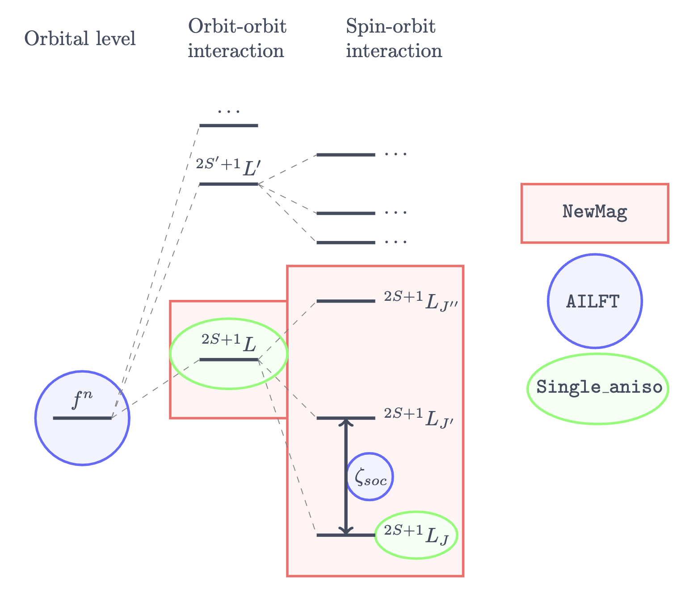
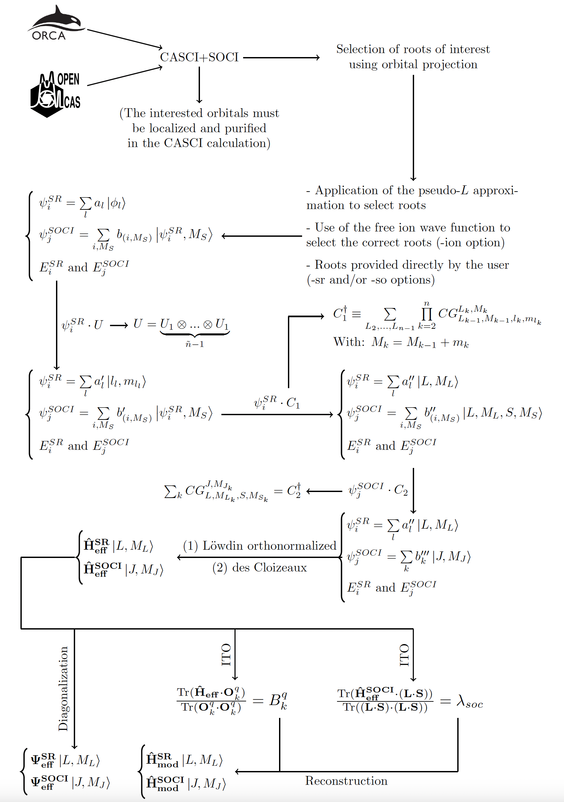

# NewMag

$\texttt{NewMag}$ is a Python 3 post-processing program designed to extract **model Hamiltonians** for crystal or ligand fields (at both scalar relativistic and spin-orbit levels) from *ab initio* data generated by **[ORCA](./Documentation/ORCA_input.md)** or **[OpenMolcas](./Documentation/OpenMolcas_input.md)**. The program performs a comprehensive analysis of the entire ground state for a given electronic configuration, with the ability to quantify $J$-mixing at the spin-orbit level.

## Main Capabilities

$\texttt{NewMag}$ can extract:

1. **Crystal Field Parameters ($B_k^q$) in two representations:**
   - $\left|L, M_l\right\rangle$ (orbital angular momentum basis)
   - $\left|J, M_J\right\rangle$ (complete ground state basis)

1. **Spin-orbit Coupling Constants:** $\lambda_{\text{soc}}$ and $\zeta_{\text{soc}}$ with or without spherical approximation

Additionally, the program can:
- Reconstruct *ab initio* Hamiltonian models from extracted parameters
- Estimate the accuracy of the extraction procedure

For a visual overview of $\texttt{NewMag}$ and its relationship to $\texttt{AILFT}$ and $\texttt{Single-aniso}$, see the diagram below:

<p align="center">

</p>

---
## Citation

If you use $\texttt{NewMag}$ in your research, please cite:

1. D.-C. Sergentu, G. Duplaix-Rata, I. Humelnicu, B. Le Guennic, and R. Maurice, "Ab initio derivation of the crystal field parameters for lanthanide ions: The $f^1$ case," *J. Chem. Phys.* **164**, 144304 (2026). [DOI:10.1063/5.0313869](https://doi.org/10.1063/5.0313869)

2. $\texttt{NewMag}$ v1.3 preprint

---
## Workflow Overview

The $\texttt{NewMag}$ workflow is illustrated below:

<p align="center">

</p>

---
## Python Environment

We recommend using **Miniconda** with the following configuration:

| Package | Version |
|---------|---------|
| python  | 3.12.11 |
| numpy   | 2.3.1   |
| pandas  | 3.0.1   |
| scipy   | 1.16.0  |
| sympy   | 1.14.0  |
| tabulate| 0.10.0  |
| h5py    | 3.14.0  |

> **Note:** The `NewMag.py` file is the main executable. The `function` folder is essential for program operation and must be located in the same directory as `NewMag.py`.

---
## Command-Line Options

### Quick Reference Table

| Option     | Required | Description                                                                           |
| ---------- | -------- | ------------------------------------------------------------------------------------- |
| `filename` | ✅        | [ORCA](./Documentation/ORCA_input.md) or [OpenMolcas](./Documentation/OpenMolcas_input.md) output file. *Recommended versions:* OpenMolcas v25.06, ORCA v6.1  |
| `-cfg`     | ✅        | Electronic configuration (e.g., `f1`, `f3`, `d1`). See supported configurations below |
| `-cas_mo`  | ❌        | Molecular orbital composition and order in CSFs                                       |
| `-ion`     | ❌        | Free ion minimal CAS output file (ORCA or OpenMolcas)                                 |
| `-sr`      | ❌        | List of scalar roots (zero-based indexing)                                            |
| `-so`      | ❌        | List of spin-orbit roots (zero-based indexing)                                        |
| `-ml`      | ❌        | Order of $m_l$ values in CSFs                                                         |
| `-soc_xyz` | ❌        | Calculate spin-orbit anisotropy constants in x/y/z coordinates                        |
| `-d`       | ❌        | Number of decimal digits for output (default: 1)                                      |
| `-p`       | ❌        | Enable verbose output                                                                 |

### Detailed Parameter Descriptions

#### Electronic Configuration (`-cfg`)
Supported electronic configurations:
- Lanthanides: `f1`, `f2`, `f3`, `f4`, `f5`, `f6`, `f8`, `f9`, `f10`, `f11`, `f12`, `f13`
- Transition metals: `d1`, `d2`, `d3`, `d4`, `d6`, `d7`, `d8`, `d9`
#### Active Space Composition (`-cas_mo`)
Specify the orbital composition and order for extended active spaces using up to 4 categories:

| Category | Description                                     | Example | Usage Notes                             |
| -------- | ----------------------------------------------- | ------- | --------------------------------------- |
| `d`      | Doubly occupied orbitals (strict occupancy = 2) | `2d`    | Orbitals labeled as "inactive"          |
| `c`      | Centered orbitals (metal-centered d/f)          | `7c`    | *Must* equal $2l+1$                     |
| `o`      | Other occupied orbitals                         | `2o`    | Ligand-centered or other metal orbitals |
| `v`      | Vacant orbitals (strict occupancy = 0)          | `3v`    | Virtual orbitals                        |

> **Important:** The sum of all category counts must exactly match the number of active orbitals.

#### Root Selection Behavior

When your molecular output contains more roots than necessary:

1. The **pseudo-L approximation** is applied by default to model the ground state
2. Alternative methods:
   - Manually select ground state roots using `-sr` and/or `-so`
   - Use a second calculation on the free ion in minimal CAS (with `-ion`) for projection-based selection

> **Important:** $\texttt{NewMag}$ cannot model excited states.

---
# Usage Guide

For detailed output interpretation, see the [comprehensive documentation](Documentation/Interpretation_NewMag_output.md).

---
## Example 1: Minimal Active Space

For minimal CAS calculations, $\texttt{NewMag}$ usage is straightforward:

1. Localize and purify active orbitals as specified in [ORCA](./Documentation/ORCA_input.md) and [OpenMolcas](./Documentation/OpenMolcas_input.md) documentation
2. Execute $\texttt{NewMag}$ with required `-cfg` parameter

**Basic Command Format:**
```console
python3 NewMag.py <output_file> -cfg <configuration>
```

### Sample Commands

1. **Cerium(III) Sandwich Complex ($f^1$)**
   ```console
   python3 NewMag.py output/Molecular/f1/Cerocene/cerocene_CAS_1_7.out -cfg f1
   ```

2. **Dysprosium(III) Sandwich Complex ($f^9$)**
   ```console
   python3 NewMag.py output/Molecular/f9/orca/Dy_Cp2.out -cfg f9
   ```

---
## Example 2: Extended Active Space

Requires `-cas_mo` parameter and orbital analysis:

1. Analyze CSFs in output to identify orbital types
2. Assign labels (`d`, `c`, `o`, `v`) to each orbital type
3. Specify orbital organization in `-cas_mo` arguments
### Case 1: Cerium Complex with $\pi$ Orbitals (CAS(5,9))
Active space composition:
- Two bonding $\pi$ orbitals
- Seven $4f$ orbitals
- Pattern: $[\pi\pi f f f f f f f]$

**Command:**
```console
python3 NewMag.py output/Molecular/f1/Cerocene/cerocene_CAS_5_9.out -cfg f1 -cas_mo 2d 7c
```
- `2d`: Fix $\pi$ orbital occupations at 2
- `7c`: Specify seven centered $f$-orbitals ($2l+1 = 7$ for $f$-orbitals)

### Case 2: Cerium Complex with f/d Orbitals (CAS(1,12))
Active space composition:
- Seven $4f$ orbitals
- Five $5d$ orbitals
- Pattern: $[fffffffddddd]$

**Two Possible Extractions:**

1. **$4f$-Centric Model** ($d$ orbitals treated as vacant): Keep $f$ orbitals active, $d$ orbitals vacant → `-cas_mo 7c 5v`
   ```console
   python3 NewMag.py output/Molecular/f1/Cerium_Aqueuse/Ce_ES_cas_fd.out -cfg f1 -cas_mo 7c 5v
   ```
   - `7c`: Seven active $f$-orbitals  ($2l+1 = 7$ for $f$-orbitals)
   - `5v`: Five virtual $d$-orbitals

1. **$5d$-Centric Model** ($f$ orbitals treated as vacant): Keep $d$ orbitals active, $f$ orbitals vacant → `-cas_mo 7v 5c`
   ```console
   python3 NewMag.py output/Molecular/f1/Cerium_Aqueuse/Ce_ES_cas_fd.out -cfg d1 -cas_mo 7v 5c
   ```
   - `7v`: Seven virtual $f$-orbitals
   - `5c`: Five active $d$-orbitals ($2l+1 = 5$ for $d$-orbitals)

---
## Example 3: Multiple S-Manifolds

The $\texttt{NewMag}$ approach to multiple spin manifolds requires:

1. Organizing ORCA/OpenMolcas output with high-spin roots appearing first
2. The pseudo-$L$ approximation selects the first root by default

**Alternative Selection Methods:**
- `-ion`: Free ion projection
- `-sr`: Manual scalar root selection

Examination of example output files is recommended:

- For OpenMolcas output:
```console
python3 NewMag.py output/Molecular/d4/molcas/Mn_Oh_SOC_2nd_order.out -cfg d4
```

- For ORCA output:
```console
python3 NewMag.py output/Molecular/d4/orca/Mn_Oh_SOC_2nd_order.out -cfg d4
```
